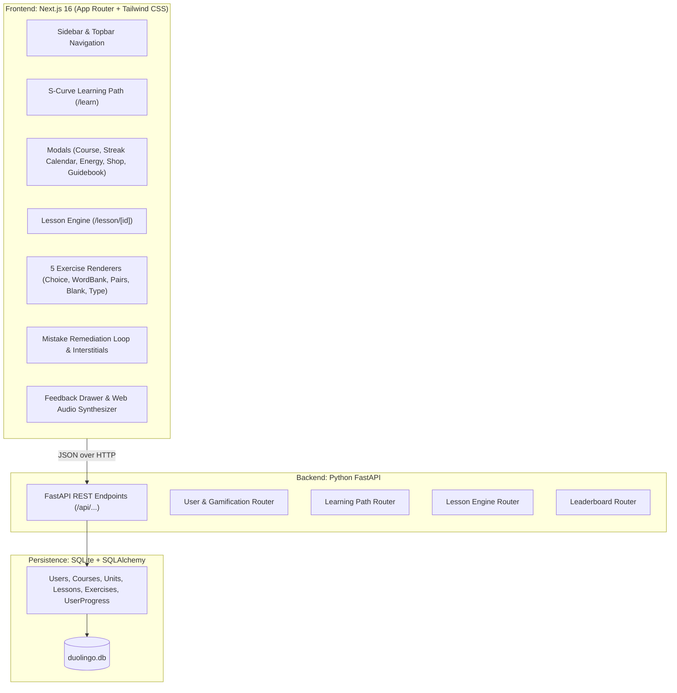
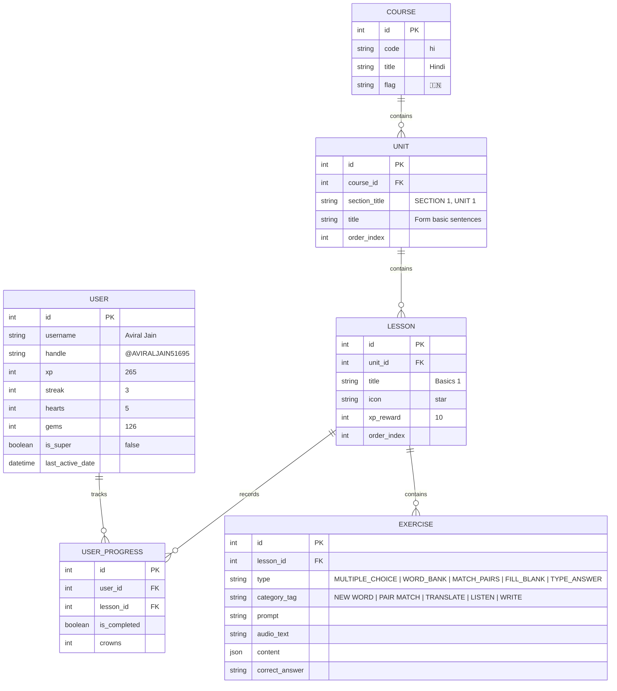

# Duolingo Web Application Clone (Fullstack)

A modern, responsive, pixel-perfect clone of the Duolingo web application built with **Next.js (TypeScript)**, **FastAPI (Python)**, and **SQLite**, specifically designed around the authentic **Hindi 1** curriculum.

---

## 🌟 Highlights & Key Features

1. **Exact 1:1 UI/UX Replication**:
   - Signature Duolingo rubbery 3D buttons (`border-b-4 active:border-b-0`).
   - Undulating S-curve skill path with Section banners, progress nodes, and mascot flourishes.
   - Interactive popovers: **Course Switcher**, **Streak Calendar**, **Shop / Super Duolingo**, **Energy & Hearts modal**, and **Unit Guidebooks**.
   - Mascot interactions (Duo the owl and Vikram character avatars).
   - High-resolution SVG Indian Flag placed directly to the left of the Streak Flame (`🔥`).
   - Duolingo logo navigating directly to the `/learn` hub from any section.
   - Authentic **MORE** dropdown matching desktop Duolingo (`DUOLINGO ENGLISH TEST` with green rosette icon, divider, `SETTINGS`, `HELP`, `LOG OUT`).

2. **Full Lesson Player Engine (The 5 Mandatory Exercise Types)**:
   - **Multiple Choice**: 3-card horizontal grid with character illustrations and keyboard shortcuts `1`, `2`, `3`; stacked wide pills with character speech bubbles.
   - **Word Bank / Tap to Translate**: Sentence translation with interactive word tokens, token bank, and instant "Use keyboard" toggle.
   - **Tap What You Hear**: Dual-speed Web Speech API Hindi pronunciation with normal speed (`0.9x`) and **Snail slow speech** (`0.5x`).
   - **Matching Pairs (Strictly Opposing Columns)**:
     - **Column 1 (Left)**: English vocabulary shuffled independently with shortcut badges `1`, `2`, `3`, `4`.
     - **Column 2 (Right)**: Hindi vocabulary shuffled independently with shortcut badges `5`, `6`, `7`, `8`.
     - **Opposite-Side Guarantee**: Pairs are strictly isolated across columns and never appear on the same side.
   - **Fill in the Blank**: Sentence gap with selectable options.
   - **Type the Answer**: Free-text Hindi/English translation with auto-focus and Enter key submission.

3. **Duolingo Spaced Mistake Remediation Loop**:
   - Incorrect answers are retained in a dedicated mistake queue.
   - Once all standard questions are answered, Duo the Owl peeks up waving with an interstitial speech bubble: *"Let's review the exercises you missed!"*.
   - Remediation questions display the amber `🔁 PREVIOUS MISTAKE` badge.
   - A lesson **cannot finish** until every missed question has been successfully answered and cleared.

4. **Live Dynamic Progress Bar**:
   - Real-time progress bar tracking correctly answered questions.
   - Animates smoothly forward upon each verified correct answer.
   - Reaches 100% only after all exercises (including remediation) are cleared.

5. **Signature Feedback Drawer & Audio Feedback**:
   - **Correct Answer**: Slide-up light green drawer (`#d7ffb8`), green checkmark, praise titles, and synthesized high chime.
   - **Wrong Answer**: Slide-up light red drawer (`#ffdfe0`), red cross, solution text, and error thud.
   - **Victory Screen**: Multi-color confetti explosion (`canvas-confetti`), victory fanfare, XP gained tally, streak counter, and **"Review Lesson"** + **"Continue"** actions.

6. **Gamification & Progress Tracking**:
   - Hearts system (lose a heart on wrong answer; out-of-hearts refill modal).
   - Daily Streak counter and calendar.
   - Silver League Leaderboard (`/leaderboard`) featuring ranked learners.
   - Letters Hub (`/characters`) with Hindi vowels & consonants with live audio.
   - Daily Quests (`/quests`) with claimable reward chests and badges.
   - Learner Profile (`/profile`) with avatar customize modal, achievements, and stats.

---

## 🏗️ System Architecture



---

## 🗄️ Database Schema (SQLite)



---

## 🚀 Setup & Running Instructions

### 1. Prerequisites
- **Node.js** (v18 or higher)
- **Python** (v3.10 or higher)

### 2. Run Backend
```bash
cd backend
pip install -r requirements.txt
python run.py
```
- API Server: `http://localhost:8000`
- Interactive Swagger Docs: `http://localhost:8000/docs`

### 3. Run Frontend
```bash
cd frontend
npm install
npm run dev
```
- Web Application: `http://localhost:3000`

---

## 🧪 Production Build Verification
To verify the full production build:
```bash
cd frontend
npm run build
```
Builds all 16 static and dynamic routes cleanly with 0 TypeScript/ESLint errors.
