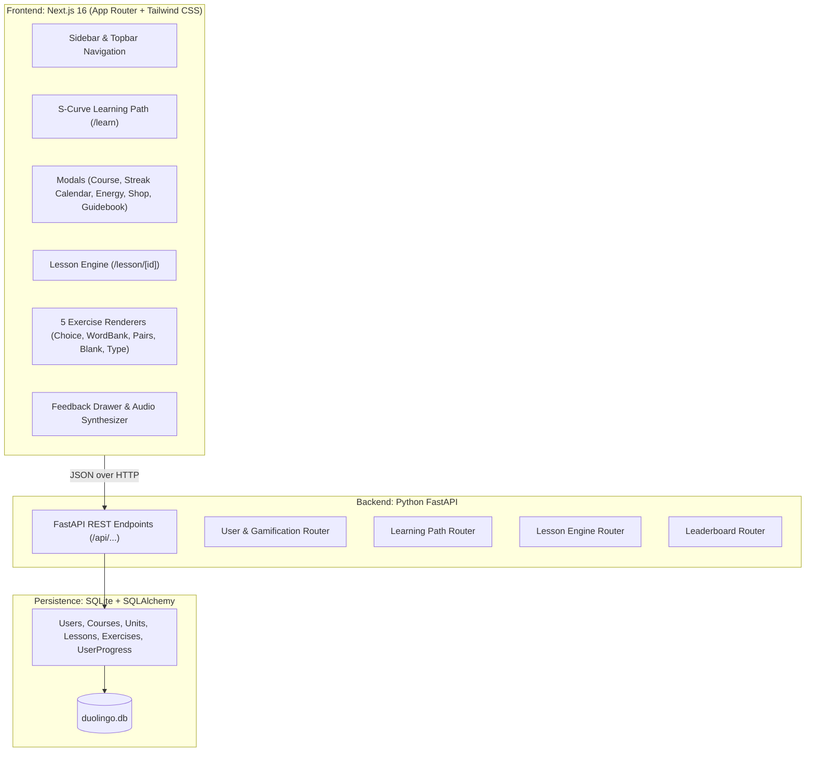
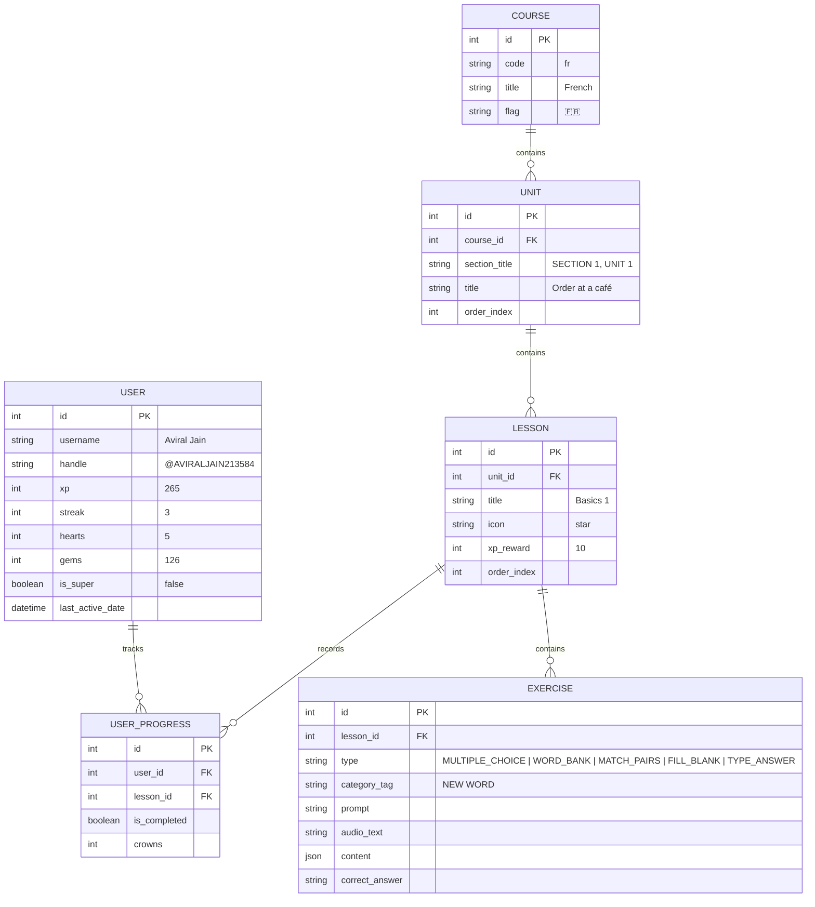

# Duolingo Web Application Clone (Fullstack)

A modern, responsive, pixel-perfect clone of the Duolingo web application built with **Next.js (TypeScript)**, **FastAPI (Python)**, and **SQLite**.

---

## 🌟 Highlights & Key Features

1. **Exact 1:1 UI/UX Replication**:
   - Signature Duolingo rubbery 3D buttons (`border-b-4 active:border-b-0`).
   - Undulating S-curve skill path with Section banners, progress nodes, and mascot flourishes.
   - Interactive popovers: **Course Switcher & Score roadmap (5 to 70)**, **October 2026 Streak Calendar**, **Shop / Super Duolingo**, **Energy & Hearts sheet**, and **Unit 1 Guidebook**.
   - Mascot interactions (Duo the owl and Lily character).

2. **Full Lesson Player Engine (The 5 Mandatory Exercise Types)**:
   - **Multiple Choice**: 2x2 image option cards with audio speech buttons.
   - **Word Bank / Tap to Translate**: Assembled sentence slot with interactive token pool.
   - **Match Pairs**: Real-time matching between foreign and English vocabulary.
   - **Fill in the Blank**: Sentence gap with selectable options.
   - **Type the Answer**: Free-text input with auto-focus and Enter key submission.

3. **Signature Feedback Drawer & Audio Feedback**:
   - **Correct Answer**: Slide-up light green drawer (`#d7ffb8`), green checkmark, and synthesized high chime.
   - **Wrong Answer**: Slide-up light red drawer (`#ffdfe0`), red cross, solution text, and error thud.
   - **Victory Screen**: Multi-color confetti explosion (`canvas-confetti`), victory fanfare, XP gained tally, and streak increment.

4. **Gamification & Progress Tracking**:
   - Hearts system (lose a heart on wrong answer; out-of-hearts modal).
   - Hearts refill via **Practice Hub** (`/practice`) and free demo refills.
   - Daily Streak counter and October calendar.
   - Silver League Leaderboard (`/leaderboard`) with ranked learners.
   - Learner Profile (`/profile`) with 4 overview stat pills (🔥 Streak, 🇫🇷 Level, 🏆 League, ⚡ Total XP) and achievements.

---

## 🏗️ System Architecture



---

## 🗄️ Database Schema (SQLite)



---

## 🚀 Setup & Running Instructions

### 1. Prerequisites
- **Node.js** (v18 or higher)
- **Python** (v3.10 or higher)

### 2. Run Frontend
```bash
cd frontend
npm install
npm run dev
```
Open [http://localhost:3000](http://localhost:3000) in your browser.

### 3. Run Backend (Optional / Connected Mode)
```bash
cd backend
pip install -r requirements.txt
python run.py
```
Backend API will be running on [http://localhost:8000](http://localhost:8000). Interactive Swagger docs available at [http://localhost:8000/docs](http://localhost:8000/docs).

---

## 🧠 Interview Defense & Technical Decisions

- **Why Next.js App Router?** Provides clean component separation, automatic route prefetching, zero runtime overhead for static routes, and smooth client transitions.
- **Why Web Audio API for sound effects?** Zero network dependency, zero audio latency, and works offline without downloading heavy MP3 assets.
- **Why normalized SQLite schema with JSON exercise content?** Standard pattern in educational quiz engines: relational structure preserves rigid constraints for units/lessons/users, while polymorphic JSON content allows varied exercise types without schema fragmentation.
